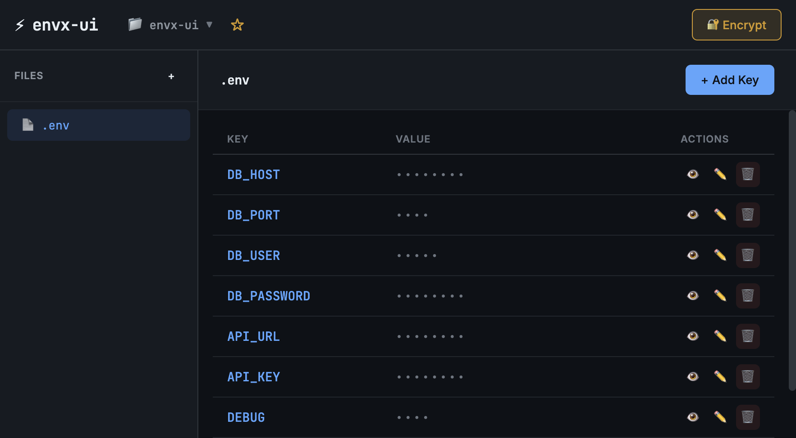

# envx-ui

A minimal local web UI for managing dotenv[x] environment files.

⚡ **Fast, zero-config, developer-friendly**



## 🔒 Privacy & Security

**This tool is 100% local and offline.**

- ✅ **No data leaves your machine** - All operations happen locally
- ✅ **No external API calls** - Zero network requests to third parties
- ✅ **No telemetry or analytics** - We don't track anything
- ✅ **No cloud storage** - Your secrets stay on your disk
- ✅ **No authentication required** - It's your local machine
- ✅ **Open source** - Inspect the code yourself

The server runs on `localhost` only and is not accessible from other machines. Your environment variables and encryption keys never leave your computer.

> 💡 **Tip**: You can verify this by checking the network tab in your browser's developer tools while using the app - you'll see only local requests to `localhost`.

## Features

- 📁 Scan and list all `.env*` files in current directory
- 🔍 Fuzzy folder search - quickly switch between projects
- 🔒 Mask values by default with show/hide toggle
- ✏️ Inline editing of environment variables
- ➕ Add new keys
- 🗑️ Delete keys
- 🔐 dotenvx encryption support (decrypt/encrypt with DOTENV_KEY)
- 💾 Preserve comments and formatting when saving
- ⭐ Save favorite folders for quick access
- 🕐 Recent folders history
- 🎨 Beautiful dark theme UI

## Screenshots

### Main Interface
The main UI shows your environment variables with masked values. Click the 👁 button to reveal values.


### Folder Search
Fuzzy search to quickly find and switch between project folders.


## Installation

```bash
npm install
```

## Usage

```bash
# Start in current directory
node cli.js

# Or specify a port
node cli.js --port 8080

# Or run via npm
npm start
```

The UI will automatically open in your default browser.

> 🔐 **Security**: By default, the server starts on a random port to prevent browser extension attacks.

Press `Ctrl+C` to stop the server.

## CLI Options

| Option | Description |
|--------|-------------|
| `-p, --port PORT` | Port to run server on (default: random) |
| `-h, --help` | Show help message |
| `-v, --version` | Show version number |

## Keyboard Shortcuts

| Shortcut | Action |
|----------|--------|
| `Enter` | Save current edit |
| `Escape` | Cancel edit or close modal |
| `Ctrl+S` | Save current edit |
| `Ctrl+N` | Add new key (when file is selected) |
| `↑` / `↓` | Navigate folder search results |

## Supported Files

The UI scans for these files in the current working directory:

- `.env`
- `.env.local`
- `.env.development`
- `.env.staging`
- `.env.production`
- `.env.test`
- `.env.*` (any other .env files)

## dotenvx Encryption

This tool fully supports [dotenvx](https://github.com/dotenvx/dotenvx) encryption for secure environment variable management.

### How It Works

```
┌─────────────────────────────────────────────────────────────────────────┐
│                        dotenvx Encryption Flow                          │
├─────────────────────────────────────────────────────────────────────────┤
│                                                                         │
│  📄 .env.production                    🔑 .env.keys                     │
│  ┌─────────────────────────┐          ┌─────────────────────────────┐  │
│  │ DB_HOST=localhost       │          │ DOTENV_PRIVATE_KEY_PROD=... │  │
│  │ DB_PASS=encrypted:...   │◄────────►│ DOTENV_PUBLIC_KEY_PROD=...  │  │
│  │ API_KEY=encrypted:...   │  decrypt │                             │  │
│  └─────────────────────────┘  encrypt └─────────────────────────────┘  │
│           │                                       │                     │
│           │                                       │                     │
│           ▼                                       ▼                     │
│  ┌─────────────────────────────────────────────────────────────────┐   │
│  │                        envx-ui                                   │   │
│  │  ┌─────────────────────────────────────────────────────────┐    │   │
│  │  │  DB_HOST    │ localhost      │ 👁 ✏️ 🗑                 │    │   │
│  │  │  DB_PASS    │ ••••••••       │ 👁 ✏️ 🗑  🔐 encrypted   │    │   │
│  │  │  API_KEY    │ ••••••••       │ 👁 ✏️ 🗑  🔐 encrypted   │    │   │
│  │  └─────────────────────────────────────────────────────────┘    │   │
│  │                                                                  │   │
│  │  [🔐 Encrypt] - Encrypts all plain text values                  │   │
│  └─────────────────────────────────────────────────────────────────┘   │
│                                                                         │
└─────────────────────────────────────────────────────────────────────────┘
```

### File Structure

```
your-project/
├── .env                    # Plain text (development)
├── .env.production         # Contains encrypted values
├── .env.staging            # Contains encrypted values
└── .env.keys               # 🔐 Private keys (add to .gitignore!)
    ├── DOTENV_PRIVATE_KEY_PRODUCTION=ec...
    ├── DOTENV_PUBLIC_KEY_PRODUCTION=03...
    ├── DOTENV_PRIVATE_KEY_STAGING=ab...
    └── DOTENV_PUBLIC_KEY_STAGING=02...
```

### Encrypted Value Format

Encrypted values in `.env` files look like this:

```bash
# Plain text value
DB_HOST=localhost

# Encrypted value (dotenvx format)
DB_PASSWORD="encrypted:BE9Y7LKANx8setup0uyYkBA+Z..."
API_KEY="encrypted:BA3pP5eKIxqN6rSFWz9nXw4C..."
```

### Encryption Workflow

1. **Reading Encrypted Files**
   - UI detects `.env.keys` file in the project
   - Loads private keys (`DOTENV_PRIVATE_KEY_*`)
   - Automatically decrypts values for display
   - Shows 🔐 indicator for encrypted values

2. **Editing Encrypted Values**
   - Click ✏️ to edit any value
   - Edit the decrypted plain text
   - Save - value is re-encrypted automatically

3. **Encrypting Plain Text Files**
   - Click "🔐 Encrypt" button
   - All plain text values are encrypted
   - Creates/updates `.env.keys` with new keys
   - Original file is updated with encrypted values

### Security Notes

| Item | Recommendation |
|------|----------------|
| `.env.keys` | ⚠️ **Add to .gitignore** - Never commit! |
| `.env.production` | ✅ Safe to commit (values are encrypted) |
| Private keys | 🔐 Share securely with team (1Password, etc.) |
| Public keys | ✅ Can be shared openly |

### Example .gitignore

```gitignore
# Environment files with secrets
.env
.env.local
.env.*.local

# dotenvx private keys - NEVER COMMIT
.env.keys

# Encrypted env files are safe to commit
# .env.production
# .env.staging
```

### Using with dotenvx CLI

This UI is fully compatible with dotenvx CLI:

```bash
# Encrypt a file
dotenvx encrypt -f .env.production

# Decrypt and run
dotenvx run -- node app.js

# Set specific key
dotenvx set API_KEY "secret" -f .env.production
```

Values encrypted by dotenvx CLI can be read/edited in envx-ui, and vice versa.

## How It Works

1. **Local Server**: Starts an Express.js server on localhost
2. **File System Access**: Reads/writes `.env` files in your project directory
3. **Browser UI**: Opens automatically in your default browser
4. **No Network**: All communication stays between your browser and local server

```
┌─────────────────────────────────────────────────────┐
│                   Your Computer                      │
│  ┌──────────┐      localhost      ┌──────────────┐  │
│  │ Browser  │ ◄──────────────────► │ Express.js  │  │
│  │   UI     │                      │   Server    │  │
│  └──────────┘                      └──────┬───────┘  │
│                                           │          │
│                                    ┌──────▼───────┐  │
│                                    │  .env files  │  │
│                                    │  (your disk) │  │
│                                    └──────────────┘  │
└─────────────────────────────────────────────────────┘
         ❌ No external connections
```

## Project Structure

```
envx-ui/
├── cli.js                   # Entry point
├── package.json
├── server/
│   ├── index.js             # Express server & routes
│   ├── env.service.js       # Env file parsing/writing
│   ├── crypto.service.js    # Encryption/decryption
│   └── folder.service.js    # Folder management
├── views/
│   └── index.ejs            # Main UI template
└── public/
    ├── style.css            # Dark theme styles
    └── app.js               # Client-side interactions
```

## Requirements

- Node.js 18+
- npm or yarn

## Dependencies

- `express` - Web server
- `ejs` - Template engine
- `open` - Browser launcher
- `@dotenvx/dotenvx` - Encryption support
- `helmet` - Security headers (CSP, XSS protection)

## Release

```bash
# Release a new version (patch/minor/major)
npm run release

# Or specify version
npm run release -- patch
npm run release -- minor
npm run release -- major
```

## Contributing

1. Fork the repository
2. Create your feature branch (`git checkout -b feature/amazing-feature`)
3. Commit your changes (`git commit -m 'Add amazing feature'`)
4. Push to the branch (`git push origin feature/amazing-feature`)
5. Open a Pull Request

## License

MIT

---

Made with ⚡ by [litepacks](https://github.com/litepacks)
